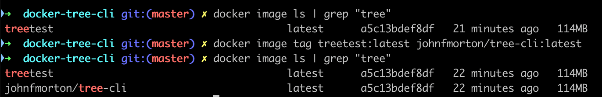

# Notes on the project

These are notes I have for myself regarding this project. They're not overly organized but they're here to capture my train of thought during the work process in case I need to reference them later.

---

After I made the Dockerfile, I built the image for local testing like this:

```
docker image build -t treetest .
```

I can then confirm that I built it correctly by listing the images I've got on my machine. Since I have a lot of images, I'm going to use `grep` to filter the images to only show ones with the word "tree" in their name.

```
docker image ls | grep "tree"
```

Now we need to test the image.

```
docker container run --rm treetest
```

Then I tested the image a few times, tweaking the default command. This involved changing the Dockerfile, rebuilding the image and then rerunning the container with the default command a few times.

```
# Default command
# CMD ["/bin/sh"]
# CMD ["/bin/sh"]?-c?["tree"]
CMD ["/usr/local/bin/tree"]
```

When I was happy with the image, I needed to tag it for pushing to Docker Hub.

```
docker image tag treetest:latest johnfmorton/tree-cli:latest
```

To confirm that the tag was successful, I can just list out the images on my machine again:

```
docker image ls | grep "tree"
```

Now I see my 'treetest' and the 'johnfmorton/tree-cli'



This works, but it doesn't work with my alias currently. The arguments are causing an issue.

```
docker run --rm -it -v `pwd`:/app johnfmorton/tree-cli tree -l 2
```

Let's make a new testing tag.

```
docker image tag johnfmorton/tree-cli:latest johnfmorton/tree-cli:dev
```

I can then test with this new image.

```
docker container run --rm johnfmorton/tree-cli:dev
```

It turned out the image was fine either way. The problem was with my alias. It should specify the 'tree' command so that flags can be passed into it.

```
alias tree='docker run --rm -it -v "$PWD":/app johnfmorton/tree-cli tree'
```

### research for passing flags to alias

https://unix.stackexchange.com/questions/3773/how-to-pass-parameters-to-an-alias

Andrew version of the alias.

```
alias tree='f(){ docker run --rm -it -v "$PWD":/app johnfmorton/tree-cli tree "$@";  unset -f f; }; f'
```

## Andrew testing

Andrew tried the command came up with this warning on his Intel Mac.

```
WARNING: The requested image's platform (linux/arm64/v8) does not match the detected host platform (linux/amd64) and no specific platform was requested
```

My image was build on my M1 Mac and didn't work natively on Intel now. Andrew solves this  now with his Github Action set up. Before that though, he use to build his images with this tag using buildx :

```
docker buildx build \
--push \
--no-cache \
--platform linux/arm/v7,linux/arm64/v8,linux/amd64 \
--tag redacted/node-dev-base:14-alpine \
--tag redacted/node-dev-base:latest .
```

I then tried my own version:

```
docker buildx build --push --no-cache --platform linux/arm/v7,linux/arm64/v8,linux/amd64 --tag johnfmorton/tree-cli:dev --tag johnfmorton/tree-cli:latest .
```

I got an error because I've not set up my own 'builder' yet for buildx.

### My own builder

```
docker buildx create --name jmxBuilder
```

I made a builder called jmxBuilder.

I then told docker to use it when running buildx:

```
docker buildx use jmxBuilder
```

I can see it by inspecting it. Note that --bootstrap isn’t needed, it just starts the build container immediately.

```
docker buildx inspect --bootstrap
```

Now, with a builder created, the command does work to build out the varios platform versions. This will build and push to my Docker Hub repo all in one command.

```
docker buildx build --push --no-cache --platform linux/arm/v7,linux/arm64/v8,linux/amd64 --tag johnfmorton/tree-cli:dev --tag johnfmorton/tree-cli:latest .
```
